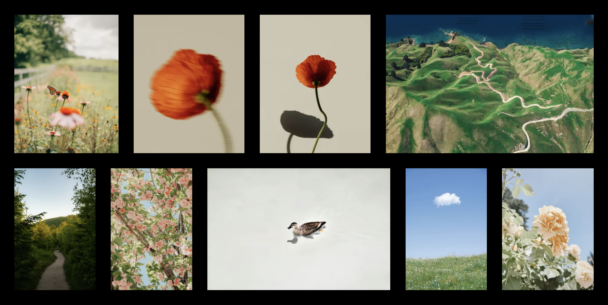

# Photos from trueberryless

See some photos I enjoy looking at. This website was created from https://github.com/evadecker/astro-photo-grid.

## Credits

- Check out the awesome [Astro template](https://github.com/evadecker/astro-photo-grid) which made this website possible!
- CSS-only justified gallery layout from [Helmut Wandl](https://medium.com/@ehtmlu/css-image-grid-gallery-4ec8824560a1) and [SmolCSS](https://smolcss.dev/#smol-aspect-ratio-gallery)
- [Fancybox](https://fancyapps.com/fancybox/) lightbox

## Development

Requires Node.js 24 and pnpm.

```shell
pnpm install
pnpm dev
```

| Command             | Description                                     |
| ------------------- | ----------------------------------------------- |
| `pnpm check`        | Type check with `astro check`                   |
| `pnpm lint`         | Lint with oxlint                                |
| `pnpm format:check` | Check formatting with Prettier                  |
| `pnpm knip`         | Find unused files and dependencies              |
| `pnpm test`         | Unit tests with Vitest                          |
| `pnpm test:e2e`     | Build, then run the Playwright end-to-end tests |

## License

Licensed under the MIT license, Copyright © trueberryless.

See [LICENSE](https://github.com/trueberryless-org/photos/blob/main/LICENSE) for more information.
